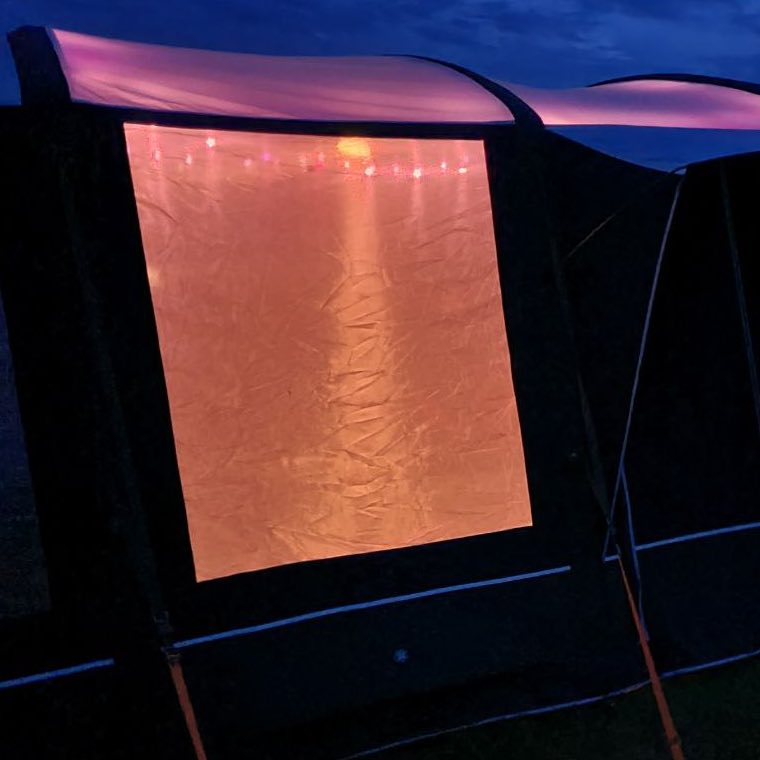

# StarLights
#### <i>Convey with simplicity!</i>

 <em>I took my StarLights camping!</em>

Make your string of Neopixels shine! This simple code allows for soft and subtle twinkling/fading effects for understated background lighting. All you need is a microcontroller and the LED wire. If you are fed up with psychadelic rainbow flashing, then this is the code for you!

See also [LightJar](https://github.com/mattura/lightjar) for a browser-controlled mood light in a jar!

## Requirements:
1) A [Plasma 2040](https://shop.pimoroni.com/products/plasma-2040) or similar microcontroller
2) A [Star Wire](https://shop.pimoroni.com/products/10m-addressable-rgb-led-star-wire) (or LED wire, LED strip, set of NeoPixels or APA LEDs - minor code changes may be needed)

## Setup
1) Connect the dotted wire of the Star Wire to +5V on the Plasma 2040 terminal,
2) Connect the middle wire to DATA (DA)
3) Connect the remaining wire to GND
4) Plug in a USB-C connector to your computer
5) Upload the code using Thonny (name it 'main.py' to auto-run without being connected to the computer)

## Use your LEDs!
Press 'B' to advance the presets in the cycle, 'A' to go back. The LEDs change slowly so do wait a few seconds after you pressed the button for the change to manifest!

If you are feeling adventurous, create your own preset colour schemes and add them to the list! See [LightJar](https://github.com/mattura/lightjar) for further information

## Help
Are you using a different microcontroller? You may need to change the button-press code - does your microcontroller have 2 buttons?

Are you using different LEDs? Check the NUM_LEDS is correct; and check the type (are they WS2812? APA?) and the RGB colour order in the 'led_strip =' line

Are you using Micropython with the Plasma library from Pimoroni? Download it [here](https://github.com/pimoroni/pimoroni-pico/releases) (pico-v1..., no need for pico_USB)

If you want to use CircuitPython - please try it! However, although I like CircuitPython a lot, I have had issues with the colour temperature of the LEDs here - these issues went away when I used the MicroPython method.

For more help using different LEDs and Thonny, check out [Pimoroni's Plasma 2040 help page](https://learn.pimoroni.com/article/plasma-2040)

## Credits
Thanks to Pimoroni of Sheffield-on-Sea for the hardware, support pages and micropython library including examples

Credit to Hel Gibbons for the Sparkle code concept and function move_to_target which was used within this code
